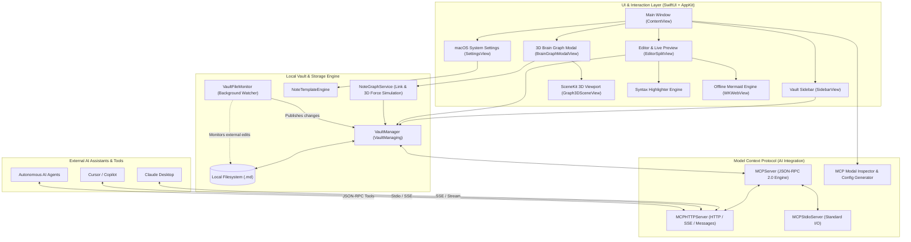

# brain.md 🧠

[](https://apple.com)
[](https://swift.org)
[](https://developer.apple.com/xcode/swiftui/)
[](https://modelcontextprotocol.io)
[](LICENSE)
[](#️-system-architecture)

> **The ultra-fast, local-first macOS Markdown knowledge base with an embedded Model Context Protocol (MCP) server.** Seamlessly bridge your personal thoughts with AI coding assistants (Claude Desktop, Cursor, Gemini, and autonomous agents).

---

## ✨ Features

- **⚡ Blazing Fast & Lightweight**: 100% native Swift 6 and SwiftUI. Instant startup, sub-50ms render latency, ~1.2 MB executable binary, and ~4.4 MB total bundle size. Zero electron or web bloat.
- **🧠 3D Visual Brain Graph**: Native Metal-accelerated 3D graph (Apple SceneKit) showing notes as velvety matte spheres clustered around folder hubs, linked via prominent 3D synaptic cylinders (`SCNCylinder` with glowing emissive materials for crystal-clear visibility), wikilinks (`[[Note]]`), markdown links, and `#tag` clusters. Features fluid organic floating and breathing animations, rotational elastic inertia, zero-allocation 120 FPS dynamic line tracking, single-click 3D trackball spin, cursor-anchored zoom, dynamic front-facing badge labels, live search filtering, and click-to-inspect popover with instant jump-to-editor navigation (`⌥⌘G`).
- **📂 Local-First Markdown Vault**: Plain-text `.md` files stored directly on your disk in human-readable hierarchies. Fully interoperable with Obsidian, VS Code, Logseq, and Git.
- **🤖 Built-in Model Context Protocol (MCP) Server**: Built-in HTTP/SSE and Stdio servers expose 8 native tools (`list_notes`, `read_note`, `create_note`, `update_note`, `delete_note`, `search_notes`, `get_vault_stats`, `move_note`) directly to AI assistants.
- **🎨 Rich Markdown Editor & Live Preview**: Real-time syntax highlighting, Split/Editor/Preview viewing modes, and GitHub Flavored Markdown (GFM) callouts (`[!NOTE]`, `[!TIP]`, `[!IMPORTANT]`, `[!WARNING]`, `[!CAUTION]`), task lists, tables, and strikethroughs.
- **💻 Vibrant Codeblocks & macOS Window Styling**: Code blocks rendered as macOS windows with traffic light dots, accent language badges, theme-driven 16-color ANSI syntax highlighting (Swift, Python, JS, TS, JSON, Bash, SQL, HTML, etc.), elevated contrast surfaces, and one-click copy.
- **🖼️ Crisp White-Background macOS App Icon**: Apple HIG squircle icon with clean white canvas gradient and subtle edge bezel for optimal contrast across light and dark macOS dock setups.
- **📊 Offline Mermaid Diagrams**: Interactive diagrams (flowcharts, sequence, class, state, git graphs) rendered completely offline via bundled `mermaid.min.js` with adaptive dark/light themes.
- **🎨 112 Custom Themes (terminalcolors.com)**: Comprehensive catalog of 80 dark and 32 light themes across 36 iconic theme families (Catppuccin, Tokyo Night, Dracula, Gruvbox, Nord, Rosé Pine, GitHub, Ayu, Solarized, Zenbones, etc.). Powers real-time syntax highlighting, custom editor canvas styling, and live color swatch previews in Settings.
- **⚙️ Modern macOS System Settings**: Native Ventura/Sonoma/Sequoia-style settings menu with custom note title formats (with dynamic tokens like `{date}`, `{time}`, `{year}`) and customizable Markdown content templates.
- **🔄 Live File Synchronization**: Automatic background file system watcher (`FSEvents` / `DispatchSource`) detects changes made by external editors in real time.
- **🔒 Secure & Private**: Offline-by-default, path traversal protection, and optional MCP read-only guard.

---

## 🏛️ System Architecture



---

## 🚀 Getting Started

### Prerequisites

- macOS 14.0 (Sonoma) or macOS 15+ (Sequoia)
- Xcode 16.0+ (with Swift 6 toolchain)

### Building from Source

1. **Clone the repository**:

   ```bash
   git clone https://github.com/your-username/brain-md.git
   cd brain-md
   ```

2. **Open in Xcode**:

   ```bash
   open brain-md.xcodeproj
   ```

3. **Or build from terminal**:

   ```bash
   xcodebuild -project brain-md.xcodeproj -scheme brain-md -destination 'platform=macOS' build
   ```

4. **Run Unit Tests**:

   ```bash
   xcodebuild test -project brain-md.xcodeproj -scheme brain-md -destination 'platform=macOS' -only-testing:brain-mdTests
   ```

---

## 🤖 AI Integration with Model Context Protocol (MCP)

`brain.md` includes an integrated MCP server that runs locally on your Mac. When running, AI agents can read notes, summarize research, perform full-text searches, create meeting logs, and reorganize your knowledge base in real time.

### Connecting Claude Desktop

1. Open `brain.md` and click the **MCP Status Badge** in the top-right toolbar (or press `⌘,` and go to the **MCP Server** tab).
2. Click **"Copy Claude Desktop Config"**.
3. Open your Claude Desktop configuration file:

   ```bash
   code ~/Library/Application\ Support/Claude/claude_desktop_config.json
   ```

4. Paste the configuration:

   ```json
   {
     "mcpServers": {
       "brain-md": {
         "url": "http://127.0.0.1:8765/sse"
       }
     }
   }
   ```

5. Restart Claude Desktop. You will now see the `brain.md` hammer icon with 8 available tools!

### Available MCP Tools

| Tool Name         | Description                                                 | Key Arguments                                           |
| :---------------- | :---------------------------------------------------------- | :------------------------------------------------------ |
| `list_notes`      | Lists notes and directory trees within the vault            | `path` *(optional)*                                     |
| `read_note`       | Reads the raw Markdown content of a specific note           | `path` *(required)*                                     |
| `create_note`     | Creates a new Markdown note in the vault                    | `path` *(required)*, `content` *(required)*             |
| `update_note`     | Appends or overwrites content in an existing note           | `path`, `content`, `mode` (`"overwrite"` or `"append"`) |
| `delete_note`     | Permanently deletes a note from the vault                   | `path` *(required)*                                     |
| `search_notes`    | Fast full-text and title search across all notes            | `query` *(required)*                                    |
| `get_vault_stats` | Retrieves note counts, word count stats, and recent actions | *None*                                                  |
| `move_note`       | Renames or moves notes into different subdirectories        | `sourcePath`, `destinationPath`                         |

For full payload specifications, schema examples, and curl tests, see [MCP Server Documentation](docs/mcp-server.md).

---

## ⌨️ Keyboard Shortcuts

| Shortcut | Action                                                   |
| :------- | :------------------------------------------------------- |
| `⌘N`     | Create a new note using active title & content templates |
| `⌘S`     | Save current note to disk immediately                    |
| `⌘F`     | Focus vault search bar                                   |
| `⌘,`     | Open macOS System Settings window                        |
| `⌘1`     | Switch to Split View (Editor + Live Preview)             |
| `⌘2`     | Switch to Editor-Only View                               |
| `⌘3`     | Switch to Preview-Only View                              |

---

## 📚 In-Depth Documentation

Explore the comprehensive technical guides in the [`docs/`](docs/) directory:

- [**System Architecture & Concurrency**](docs/architecture.md): Deep-dive into Swift 6 concurrency, view models, and AppKit integration.
- [**Vault & File Management**](docs/vault-management.md): Directory trees, background watchers, debounced auto-save, and template engines.
- [**Markdown Editor & Diagrams**](docs/editor-and-markdown.md): Syntax highlighter parser, offline Mermaid diagram engine, and GFM features.
- [**Model Context Protocol (MCP)**](docs/mcp-server.md): Protocol specifications, SSE transports, tool schemas, and AI agent configuration.
- [**Settings & Customization**](docs/settings-and-customization.md): macOS Ventura-style settings architecture, token formatting, and custom Markdown templates.
- [**Development & Testing**](docs/development-and-testing.md): Building, testing, benchmarking, and contributing to `brain.md`.

---

## 📄 License

`brain.md` is free software: you can redistribute it and/or modify it under the terms of the [GNU General Public License v3.0 (GPLv3)](LICENSE).
