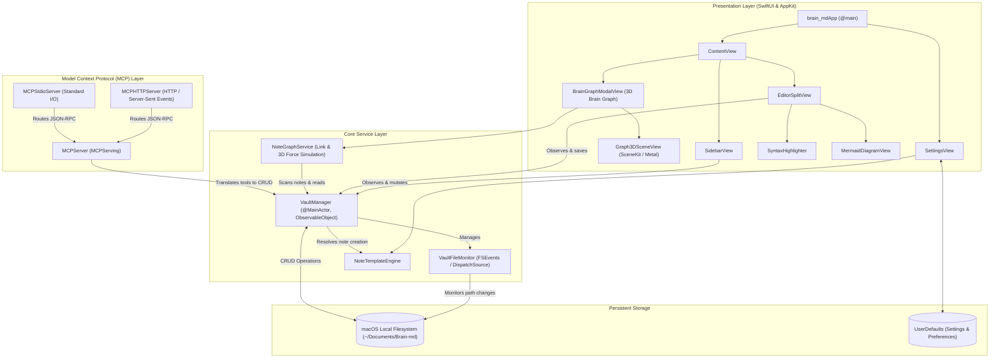
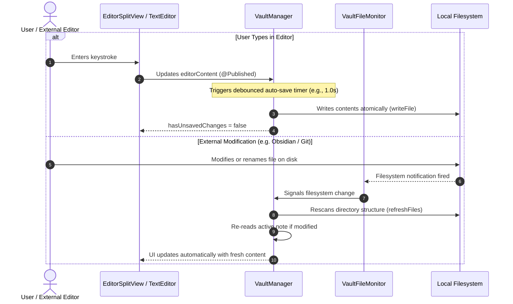
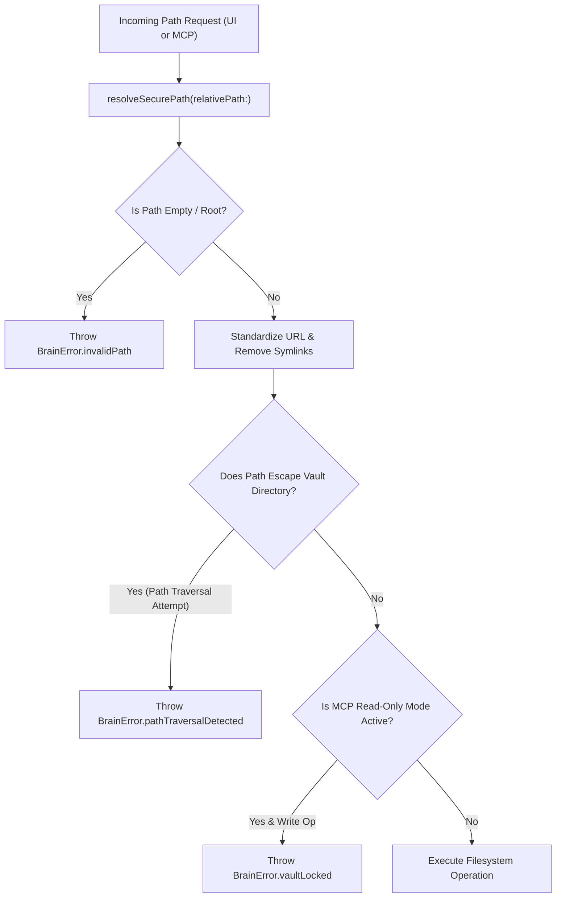

# System Architecture & Technical Design

This document details the architectural principles, component structure, state management, and security model of `brain-md`.

---

## High-Level Architecture Overview

`brain-md` is designed around three primary decoupled subsystems:
1. **Presentation Layer (SwiftUI + AppKit)**: Reactive, declarative UI combined with targeted AppKit primitives for native window styling, split views, and keyboard acceleration.
2. **Local Storage & Vault Engine**: Direct filesystem-backed document store with tree-building, real-time background file monitoring, and template resolution.
3. **Model Context Protocol (MCP) Server**: Embedded JSON-RPC 2.0 engine exposing vault operations to local and network AI agents via HTTP/SSE and Standard I/O.



---

## Reactive State Management & Data Flow

`brain-md` uses a unidirectional, reactive data flow powered by Swift's `ObservableObject` and `@Published` properties, anchored by `VaultManager.shared`.



---

## Swift 6 Strict Concurrency Architecture

`brain-md` is built with Swift 6 strict concurrency checks enabled (`-strict-concurrency=complete`), ensuring data-race safety across background tasks and UI rendering.

### Isolation Boundaries

1. **`@MainActor` Protocol (`VaultManaging`)**:
   - The primary vault contract (`VaultManaging`) is isolated to the main actor:
     ```swift
     @MainActor
     public protocol VaultManaging: AnyObject { ... }
     ```
   - All state affecting UI rendering (such as `rootItems`, `selectedItem`, `editorContent`, `editorTitle`, `hasUnsavedChanges`) is guaranteed to mutate exclusively on the main thread.

2. **Thread-Safe Background File Monitoring (`VaultFileMonitor`)**:
   - `VaultFileMonitor` encapsulates file descriptor watching using a dedicated GCD serial dispatch queue (`DispatchSourceFileSystemObject`).
   - When external changes occur, notifications are dispatched to the main thread via:
     ```swift
     DispatchQueue.main.async { [weak self] in
         self?.onChange?()
     }
     ```
   - In `VaultManager.deinit`, teardown calls `fileMonitor.stop()` directly on the thread-safe monitor instance without referencing `self`, eliminating actor isolation violations.

3. **Pure Functional Engines (`NoteTemplateEngine`)**:
   - `NoteTemplateEngine` functions are static, nonisolated, and `Sendable`, taking pure values and returning pure strings without holding mutable shared state.

---

## Security & Sandboxing Model

`brain-md` enforces defensive programming at every input boundary:



### Path Traversal Protection
All relative paths supplied by users or AI tools are validated through `resolveSecurePath`:
```swift
private func resolveSecurePath(relativePath: String) throws -> URL {
    let clean = relativePath.trimmingCharacters(in: CharacterSet(charactersIn: "/"))
    guard !clean.isEmpty else { return vaultURL }
    let candidate = vaultURL.appendingPathComponent(clean).standardizedFileURL
    guard candidate.path.hasPrefix(vaultURL.path) else {
        throw BrainError.pathTraversalDetected(path: relativePath)
    }
    return candidate
}
```
If an AI agent or malicious input passes `../../etc/passwd` or `/System/Volumes`, `BrainError.pathTraversalDetected` is thrown immediately.

### MCP Read-Only Guard
In the **MCP Server** settings pane, users can enable **Read-Only Mode**. When active, all mutating tools (`create_note`, `update_note`, `delete_note`, `move_note`) are rejected with a standardized error code before any filesystem modification occurs.

---

## Performance Optimizations

1. **Sub-second Startup**: Direct lightweight AppKit/SwiftUI scene graph initialization avoids third-party SDK overhead.
2. **Directory Tree Caching**: File trees (`NoteItem`) are constructed through depth-first scanning only when directory events trigger or explicit user actions occur.
3. **Syntax Highlighting Caching**: Regular expressions for Markdown tokens and code fence matching are compiled once and cached statically in memory.
4. **Offline Asset Bundling**: The Mermaid JavaScript bundle (`mermaid.min.js`) is stored locally inside `brain-md/Resources/`, avoiding network latency, external dependencies, or telemetry leaks.
