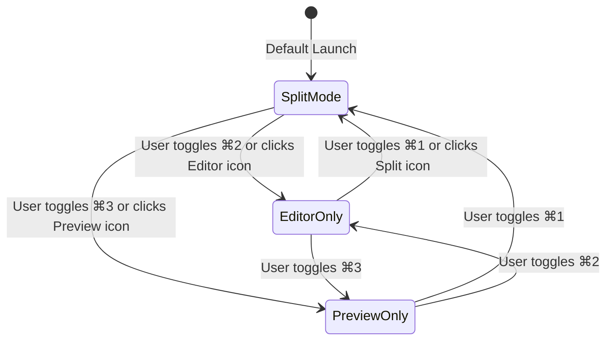
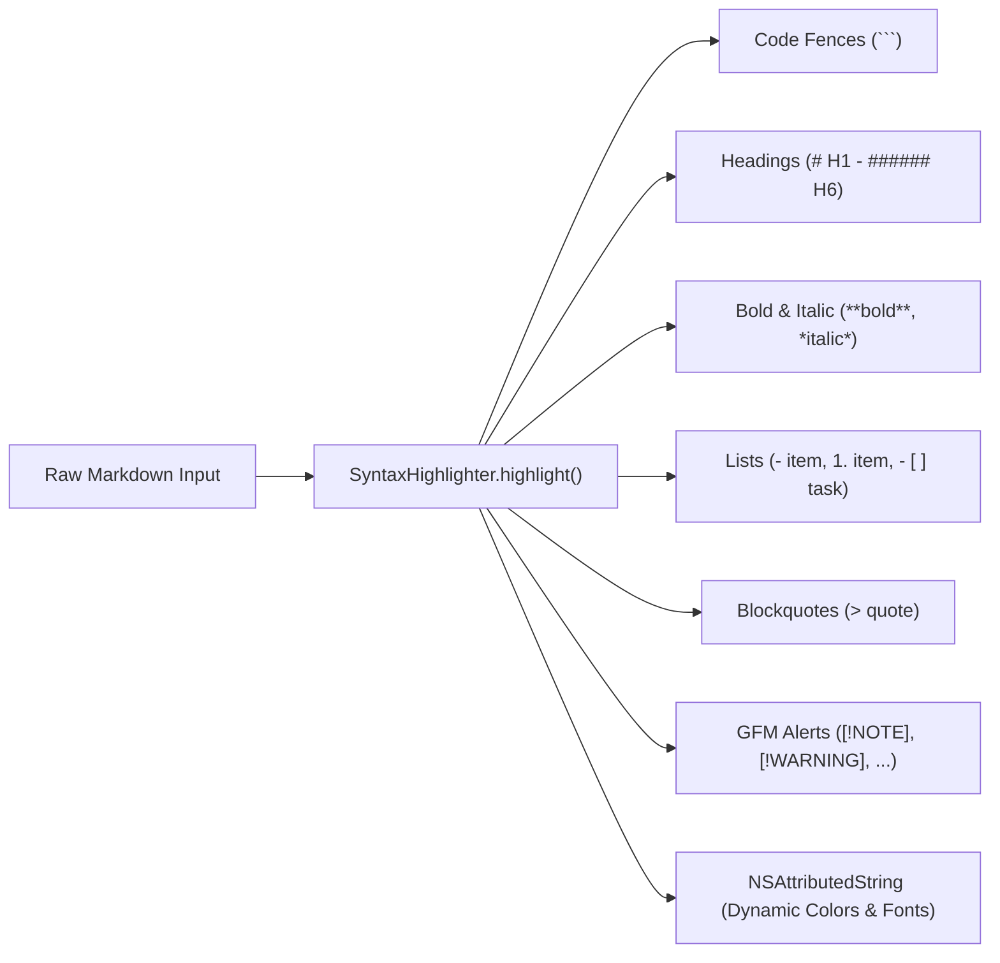
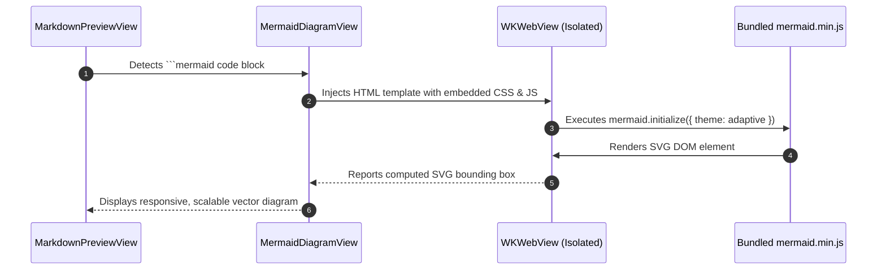
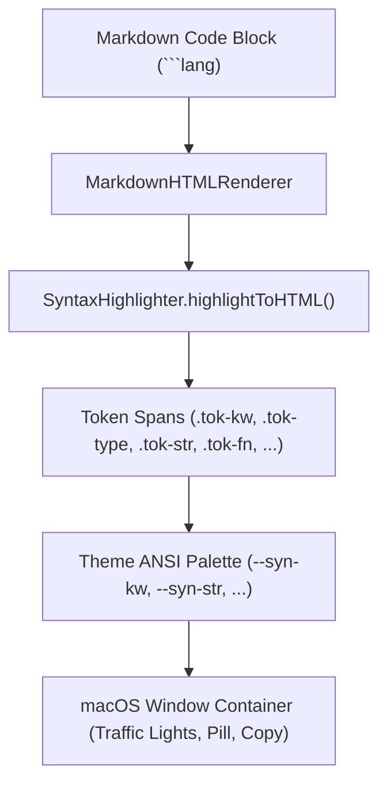

# Markdown Editor, Syntax Highlighting & Mermaid Diagrams

This document details the editing, parsing, live previewing, and diagram rendering capabilities of `brain-md`.

---

## Editor Architecture

The editor interface is built around a versatile split-pane system managed by `EditorSplitView`:



### View Modes

- **Split Mode (`⌘1`)**: Dual-pane view with real-time synchronized editor on the left and rich live preview on the right.
- **Editor-Only (`⌘2`)**: Full-width focused writing environment optimized for typing and distraction-free editing.
- **Preview-Only (`⌘3`)**: Full-width presentation and reading mode, ideal for reviewing formatted documents and diagrams.

---

## Real-Time Syntax Highlighting

`brain-md` uses a custom, high-performance regex-based syntax highlighter (`SyntaxHighlighter.swift`) running directly on macOS `NSTextStorage` / `AttributedString`.



### Supported Syntactic Elements

- **Headers**: Scaled dynamic type font weights for `#` through `######`.
- **Code Fences**: Monospaced font styling with subtle tinted background bands.
- **Inline Code**: Inline monospaced chips (`code`).
- **Links**: Tinted accent text for `[title](url)`.
- **Task Lists**: Distinct visual checkbox badges (`- [ ]` and `- [x]`).
- **Dividers**: Styled horizontal rules (`---` or `***`).

---

## GitHub Flavored Markdown (GFM) Enhancements

`brain-md` fully supports standard GFM extensions:

### 1. Callout Alerts

Alert blocks render with distinctive native icons, colored borders, and tinted backgrounds:

```markdown
> [!NOTE]
> Useful background information and context.

> [!TIP]
> Helpful recommendations and performance optimizations.

> [!IMPORTANT]
> Crucial information necessary for your workflow.

> [!WARNING]
> Urgent warnings about breaking changes or edge cases.

> [!CAUTION]
> High-risk actions that require immediate user care.
```

### 2. Task Lists

Interactive task list items:

```markdown
- [x] Implement MCP JSON-RPC protocol
- [x] Add offline Mermaid diagram rendering
- [ ] Connect remote agent catalog
```

### 3. Tables with Alignment

```markdown
| Feature | Supported | Latency |
| :--- | :---: | ---: |
| Native Swift 6 | Yes | < 1ms |
| GFM Alerts | Yes | < 5ms |
| Mermaid Diagrams | Yes (Offline) | ~30ms |
```

---

## Offline Mermaid Diagram Rendering

One of `brain-md`'s most powerful features is **100% offline, native Mermaid diagram rendering**.



### Key Technical Details

1. **Local Bundling**: Uses `mermaid.min.js` stored inside `brain-md/Resources/`. No internet connection or external CDN required.
2. **Theme Synchronization**: The diagram automatically detects whether the user is in Dark or Light mode (or System preference) and dynamically applies matching Mermaid themes (`dark` or `default`).
3. **Interactive Controls**: Users can zoom, pan, and reset the diagram view using the built-in toolbar controls in `MermaidDiagramView`.
4. **Supported Diagram Types**:
   - Flowcharts (`graph TD`, `graph LR`)
   - Sequence Diagrams (`sequenceDiagram`)
   - Class Diagrams (`classDiagram`)
   - State Diagrams (`stateDiagram-v2`)
   - Entity-Relationship Diagrams (`erDiagram`)
   - Gantt Charts (`gantt`)
   - Git Graphs (`gitGraph`)
   - Pie Charts (`pie`)

---

## Frontmatter & Metadata Card

Notes support YAML frontmatter blocks bounded by `---` delimiters at the beginning of the file.

```yaml
---
title: "Telenet Strategy"
date: 2026-09-23 | 16:24
description: "Overview of enterprise fiber rollout"
tags: ["telecom", "belgium", ]
---
```

### Robust Tag Formatting & Quote Stripping

- **Flexible Syntax**: Tags can be specified as inline arrays (`[telecom, belgium]`), quoted arrays (`["telecom", "belgium", ]`), smart/curly quotes (`[“telecom”, ‘belgium’, ]`), multiline lists (`- telecom`), or comma-separated scalars (`"telecom", "belgium"`).
- **Trailing Comma Tolerance**: Trailing commas such as `tags: [telecom, ]` or `tags: ["telecom", ]` are gracefully handled without creating phantom blank tags or formatting issues.
- **Automatic Quote Stripping**: Surrounding double quotes (`"`), single quotes (`'`), smart/curly quotes (`“”‘’`), and backticks (`` ` ``) are automatically stripped from tags, title, description, and other scalar metadata fields when rendered into UI pills, badges, and preview cards.

---

## Vibrant Codeblock Rendering & macOS Container Styling

Rendered code blocks in the live preview are styled as macOS-native code windows rather than dull, flat grey containers:



### Visual and Functional Features

- **macOS Window Traffic Lights**: Iconic red (`#ff5f56`), yellow (`#ffbd2e`), and green (`#27c93f`) window controls embedded in the header.
- **Theme-Driven Syntax Tokens**: Full syntax highlighting across Swift, Python, JavaScript, TypeScript, JSON, Bash, SQL, HTML, CSS, YAML, and Mermaid, mapped directly to the active `TerminalTheme`'s 16-color ANSI palette.
- **Accent Language Pill**: Clean badge displaying the uppercase language identifier with accent coloring.
- **Elevated Contrast Background**: Replaced flat monochromatic grey with rich elevated dark (`#161b22`) or crisp light (`#f6f8fa`) surfaces with subtle depth shadow.
- **One-Click Copy**: Fast clipboard copy with instant "Copied!" green feedback indicator.
- **Polished Inline Code**: Inline code chips with subtle theme-tinted backgrounds and borders.
