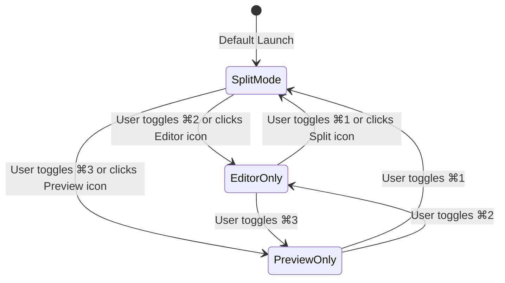
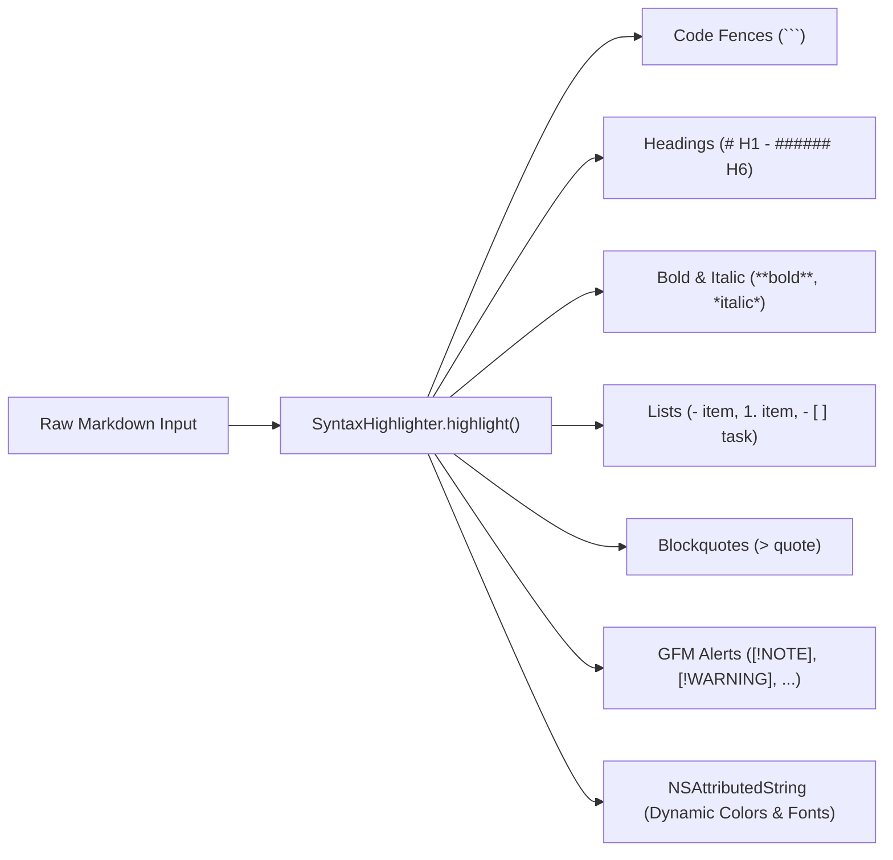
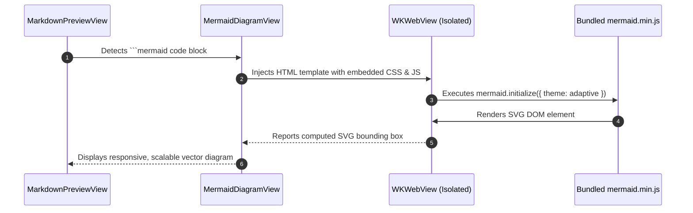
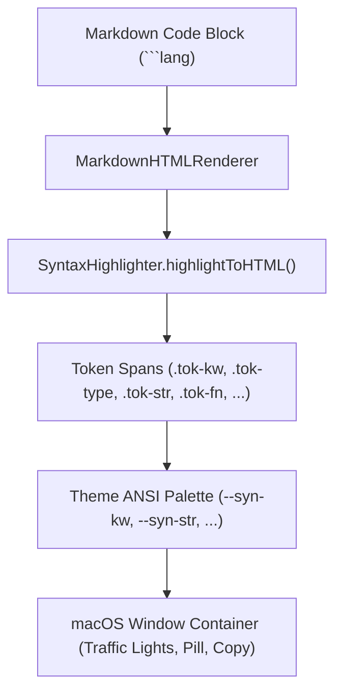
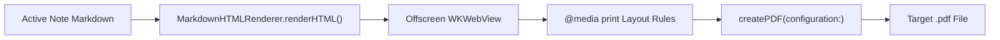
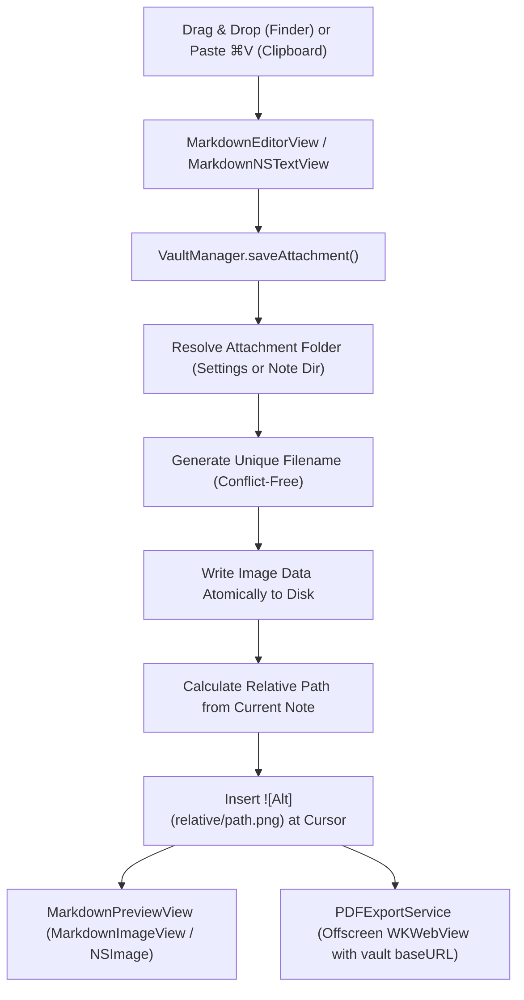
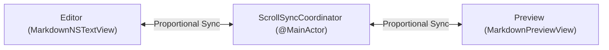

# Markdown Editor, Syntax Highlighting & Mermaid Diagrams

This document details the editing, parsing, live previewing, and diagram rendering capabilities of `brain-md`.

---

## Editor Architecture

The editor interface is built around a versatile split-pane system managed by `EditorSplitView`:


```mermaid
stateDiagram-v2
    [*] --> SplitMode: Default Launch
    SplitMode --> EditorOnly: User toggles ⌘2 or clicks Editor icon
    SplitMode --> PreviewOnly: User toggles ⌘3 or clicks Preview icon
    EditorOnly --> SplitMode: User toggles ⌘1 or clicks Split icon
    EditorOnly --> PreviewOnly: User toggles ⌘3
    PreviewOnly --> SplitMode: User toggles ⌘1
    PreviewOnly --> EditorOnly: User toggles ⌘2
```

### View Modes

- **Split Mode (`⌘1`)**: Dual-pane view with real-time synchronized editor on the left and rich live preview on the right.
- **Editor-Only (`⌘2`)**: Full-width focused writing environment optimized for typing and distraction-free editing.
- **Preview-Only (`⌘3`)**: Full-width presentation and reading mode, ideal for reviewing formatted documents and diagrams.

### Synchronized Scrolling & Viewport Stability

`brain-md` features intelligent, proportional scroll synchronization and viewport stability controls:

- **Bidirectional Synchronized Scrolling (`ScrollSyncCoordinator`)**: In Split View, the editor and live preview scroll in proportional lockstep ($0.0 \dots 1.0$) across different document heights. Features a synchronous re-entrancy lock, live-scroll driver ownership (`willStartLiveScroll` / `didEndLiveScroll`), a user-intent gate against layout-driven echoes, and inset- and flip-aware overscroll clamping, so elastic rubber-band scrolling never oscillates, cancels AppKit bounce physics, or pushes the peer pane past its content.
- **1-Click Toolbar Toggle**: Toggle scroll synchronization on or off directly from the editor toolbar in Split View (`link` / `link.badge.plus`) or via **Settings > Editor & Markdown > Workspace Layout**.
- **Jitter-Free Bottom Editing**: The editor enforces contiguous text layout (`allowsNonContiguousLayout = false`), eliminating viewport jump glitches when typing near the bottom of long documents.
- **Bottom Overscroll (Scroll Beyond Last Line)**: A 200 pt bottom content inset and inflated cursor visibility rect (40 pt vertical padding) ensure active typing lines never stick to the bottom window border.

### Interactive Draggable Split Divider (`SplitDivider`)

The dual-pane Split View features an interactive, high-precision draggable split divider:

- **Proportional Dragging**: Drag the divider left or right to adjust the proportion between the Markdown editor and live preview. The proportion is constrained between 20% and 80% to ensure both panes always maintain comfortable reading and editing widths.
- **Snap-to-Center (Double-Click)**: Double-clicking the divider pill handle instantly snaps the layout back to a 50/50 balance with smooth spring animation.
- **Persistent Layout**: The split ratio is saved in `@AppStorage("editor_split_ratio")` and can also be adjusted or reset from **Settings > Editor & Markdown > Workspace Layout**.
- **Native Cursor Affordance**: Hovering over the divider displays the macOS native `NSCursor.resizeLeftRight` cursor and highlights the handle.

### Spotlight Quick Switcher (`QuickSwitcherModalView` - `⌘O`)

Pressing `⌘O` (or clicking the magnifying glass toolbar button) summons the Spotlight-style Quick Switcher:

- **Real-Time Note Search**: Fast substring and fuzzy title/path matching across all notes in the vault.
- **Keyboard-Driven Workflow**: Navigate results using `↑` and `↓` arrow keys, press `Return` to jump immediately to the note, or press `Escape` to dismiss.
- **Folder Badges**: Displays directory location tags alongside note titles to differentiate identically named notes across subfolders.

---

## Real-Time Syntax Highlighting

`brain-md` uses a custom, high-performance regex-based syntax highlighter (`SyntaxHighlighter.swift`) running directly on macOS `NSTextStorage` / `AttributedString`.


```mermaid
flowchart LR
    RawText["Raw Markdown Input"] --> Lexer["SyntaxHighlighter.highlight()"]
    Lexer --> Fences["Code Fences (```)"]
    Lexer --> Headers["Headings (# H1 - ###### H6)"]
    Lexer --> Emphasis["Bold & Italic (**bold**, *italic*)"]
    Lexer --> Lists["Lists (- item, 1. item, - [ ] task)"]
    Lexer --> Blockquotes["Blockquotes (> quote)"]
    Lexer --> Callouts["GFM Alerts ([!NOTE], [!WARNING], ...)"]
    Lexer --> Output["NSAttributedString (Dynamic Colors & Fonts)"]
```

### Supported Syntactic Elements

- **Headers**: Scaled dynamic type font weights for `#` through `######`.
- **Code Fences**: Monospaced font styling with subtle tinted background bands.
- **Inline Code**: Inline monospaced chips (`code`).
- **Links**: Tinted accent text for `[title](url)`.
- **Task Lists**: Distinct visual checkbox badges (`- [ ]` and `- [x]`).
- **Dividers**: Styled horizontal rules (`---` or `***`).

---

## Editor Typography & Native Substitution Controls

To guarantee reliable Markdown syntax editing without unexpected macOS text transformations:

1. **Ligature Suppression**: Font ligatures are explicitly turned off (`.ligature: 0` and `kCommonLigaturesOffSelector`), preventing consecutive dashes (`---`) or symbols from merging into single connected glyphs.
2. **Raw Dashes & Quotes**:
   - `isAutomaticDashSubstitutionEnabled = false`: Typing three dashes (`---`) remains raw ASCII dashes, ensuring YAML frontmatter and thematic horizontal rules never turn into em-dashes (`—`).
   - `isAutomaticQuoteSubstitutionEnabled = false`: Preserves straight single (`'`) and double (`"`) quotes required for code blocks, frontmatter values, and HTML attributes without macOS "smart quote" conversion.
   - `isAutomaticTextReplacementEnabled = false`: Prevents accidental substitution of Markdown snippets.

---

## Markdown Autocomplete, Auto-Pairing & Selection Wrapping

The editor features responsive code-editor grade auto-pairing and autocomplete:

### 1. Delimiter Auto-Pairing & Overtype Skip

- Typing `'`, `"`, `(`, `[`, `{`, `<`, or `` ` `` automatically inserts the matching closing delimiter and places the insertion point between them.
- If the cursor is positioned directly before a closing character and the user types that character, the cursor cleanly skips over without duplicating it.

### 2. Markdown Emphasis & Code Block Autocomplete

- **Triple Backtick (`\`\`\``) Expansion**: Typing a 3rd backtick expands immediately into a multiline fenced code block with the cursor positioned on the middle line:

  ````markdown
  ```
  |
  ```
  ````

- **Double Asterisks (`**`) & Tildes (`~~`)**: Typing the second `*` or `~` immediately creates the closing pair (`**|**` or `~~|~~`).
- **Balanced Pair Deletion**: Pressing Backspace when the cursor is between paired symbols (`''`, `""`, `()`, `[]`, `{}`, `<>`, pairs of backticks, `****`, `~~~~`, `____`) cleanly deletes both opening and closing delimiters.
- **VS Code-Style Hierarchical List Continuation**: Pressing Return on a list item (`-`, `*`, `+`, `1.`, `- [ ]`) automatically preserves the exact leading indentation level (`24pt` per level).
- **Progressive Outdenting on Return**: Pressing Return on an empty indented list item (such as an indented bullet) progressively outdents it by 2 spaces (to root level) instead of deleting the line, matching VS Code and Obsidian workflows. Pressing Return on a root-level empty bullet exits list mode cleanly.
- **Tab & Shift-Tab Indentation**:
  - `Tab`: Indents the current list item or selected line block by 2 spaces.
  - `Shift-Tab` (`insertBacktab`): Outdents the current line or selection by removing up to 2 leading spaces.

### 3. Selection Wrapping

Selecting text and typing any pairing character (`'`, `"`, `(`, `[`, `{`, `<`, backtick, `*`, `_`, `~`) wraps the selected text in the delimiters while preserving the selection.

---

## 120 FPS ProMotion Performance & Architecture

To achieve butter-smooth 120 FPS typing responsiveness on Apple Silicon ProMotion displays:

1. **Hardware-Accelerated Layer Backing**:
   - `NSScrollView`, its clip view (`contentView`), and `MarkdownNSTextView` all run with `wantsLayer = true` and `canDrawConcurrently = true`. Core Animation and Metal handle display compositing with zero main-thread CPU layout bottlenecks.
2. **Debounced Preview Synchronization (~90ms)**:
   - Keystrokes in `MarkdownNSTextView` do not trigger synchronous document re-parsing or SwiftUI preview view-tree recreations. Document synchronization to `@Binding var text` is debounced by 90ms.
   - Any pending sync is immediately flushed on Save (`⌘S`) or when the editor resigns first responder.
3. **Coalesced Syntax Highlighting Pass (~40ms)**:
   - Regular-expression evaluation across the document runs with a 40ms debounce, ensuring keystroke latency stays under `1ms` for seamless 120 FPS input.

---

## Hierarchical Bullet Indentation & Heading Spacing

### VS Code-Style Bullet Glyph Hierarchy

Both the native SwiftUI preview (`MarkdownPreviewView`) and the HTML/PDF renderer (`MarkdownHTMLRenderer`) map nested list indentation (`24pt` per level) to distinct hierarchical bullet glyphs matching VS Code:

| Nesting Level | Indentation | Native Glyph | Visual Style |
| :--- | :--- | :--- | :--- |
| **Level 0** (Root) | `0pt` | `•` | Solid disc (`Circle().fill(...)`) |
| **Level 1** (1st Nest) | `24pt` | `◦` | Hollow ring (`Circle().strokeBorder(...)`) |
| **Level 2** (2nd Nest) | `48pt` | `▪` | Solid square (`Rectangle().fill(...)`) |
| **Level 3+** (Deep) | `72pt+` | `▫` | Hollow square (`Rectangle().strokeBorder(...)`) |

### Generous Heading Spacing

Headings feature expansive top and bottom spacing to provide clear typographic hierarchy:

- **H1 (`#`)**: `28pt` top margin, `12pt` bottom margin with subtle thematic divider.
- **H2 (`##`)**: `24pt` top margin, `10pt` bottom margin with divider.
- **H3 (`###`)**: `20pt` top margin, `8pt` bottom margin.
- **H4 (`####`)**: `16pt` top margin, `6pt` bottom margin.
- **H5 (`#####`)**: `14pt` top margin, `4pt` bottom margin.
- **H6 (`######`)**: `12pt` top margin, `4pt` bottom margin.
- **In-Editor Spacing**: `SyntaxHighlighter` dynamically applies paragraph spacing before headings (`paragraphSpacingBefore`) directly within AppKit `NSTextStorage`.

---

## Toolbar Formatting & Menu Controls

The editor header features quick formatting controls located directly above the editor pane:

### 1. Dedicated Headings Toolbar Item (`#`)

Located as a standalone toolbar button with a dropdown menu:

- **Heading 1 (`#`)**: `⌘⌥1`
- **Heading 2 (`##`)**: `⌘⌥2`
- **Heading 3 (`###`)**: `⌘⌥3`
- **Heading 4 (`####`)**: `⌘⌥4`
- **Heading 5 (`#####`)**: `⌘⌥5`
- **Heading 6 (`######`)**: `⌘⌥6`

*Behavior*: If a line or text is selected, it toggles/replaces the heading prefix; if empty, it inserts the heading template with placeholder text selected.

### 2. Format Toolbar Section (`textformat`)

Provides instant insertion and wrapping for all standard Markdown syntax elements:

- **Paragraphs**: Inserts clean double-spaced paragraph blocks.
- **Line Breaks**: Inserts standard two-space trailing line breaks.
- **Emphasis**:
  - **Bold** (`**text**` / `⌘B`)
  - **Italic** (`*text*` / `⌘I`)
  - **Bold & Italic** (`***text***`)
  - **Strikethrough** (`~~text~~`)
- **Blockquotes**: Prepends `>` to selected lines or inserts blockquote template.
- **Lists**:
  - **Bullet List** (`- item`)
  - **Numbered List** (`1. item`)
  - **Task List** (`- [ ] task`)
- **Code**:
  - **Inline Code** (`` `code` `` / `⌘E`)
  - **Code Block** (```` ``` ```` / `⌘⌥C`)
- **Horizontal Rules**: Inserts `\n\n---\n\n`.
- **Links & Images**:
  - **Link** (`[title](url)` / `⌘K`)
  - **Image** (``)
- **Escaping Characters**: Escapes Markdown syntax characters (`\*`, `\#`, etc.).
- **HTML**: Inserts Markdown-compatible HTML container blocks (`<div class="note">...</div>`).

All formatting actions integrate seamlessly with AppKit undo/redo (`⌘Z` / `⇧⌘Z`).

## GitHub Flavored Markdown (GFM) Enhancements

`brain-md` fully supports standard GFM extensions:

### 1. Callout Alerts

Alert blocks render with distinctive native icons, colored borders, and tinted backgrounds:

```markdown
> [!NOTE]
> Useful background information and context.

> [!TIP]
> Helpful recommendations and performance optimizations.

> [!IMPORTANT]
> Crucial information necessary for your workflow.

> [!WARNING]
> Urgent warnings about breaking changes or edge cases.

> [!CAUTION]
> High-risk actions that require immediate user care.
```

### 2. Task Lists

Interactive task list items:

```markdown
- [x] Implement MCP JSON-RPC protocol
- [x] Add offline Mermaid diagram rendering
- [ ] Connect remote agent catalog
```

### 3. Tables with Alignment

```markdown
| Feature | Supported | Latency |
| :--- | :---: | ---: |
| Native Swift 6 | Yes | < 1ms |
| GFM Alerts | Yes | < 5ms |
| Mermaid Diagrams | Yes (Offline) | ~30ms |
| HTML & Markdown Hacks | Yes | < 2ms |
```

---

## Complete Markdown Guide & GitHub Standards

`brain-md` strictly adheres to the specifications from [Markdown Guide Basic Syntax](https://www.markdownguide.org/basic-syntax/), [Extended Syntax](https://www.markdownguide.org/extended-syntax/), and [Markdown Hacks](https://www.markdownguide.org/hacks/).


```mermaid
flowchart TD
    Raw["Markdown & HTML Source"] --> Parser["MarkdownPreviewView.parseDocument()"]
    Parser --> Setext["Setext Headings (===, ---) & Custom IDs ({#id})"]
    Parser --> Tildes["Tilde Code Blocks (~~~lang)"]
    Parser --> Details["Collapsible Blocks (<details><summary>)"]
    Parser --> DefList["Definition Lists (Term / : Definition)"]
    Parser --> Comments["Markdown Comments ([comment]: #)"]
    Parser --> Inline["Inline Sanitizer & Formatter"]
    Inline --> Highlights["Highlights (==text== / <mark>)"]
    Inline --> SubSup["Subscript (~sub~ / <sub>) & Superscript (^sup^ / <sup>)"]
    Inline --> Tags["HTML Elements (<kbd>, <ins>, <u>, <font>, <span>)"]
    Inline --> Emojis["Emoji Shortcodes (:tada:, :rocket:, ...)"]
    Inline --> Entities["HTML Entities (&nbsp;, &copy;, &mdash;, &#124;)"]
    Inline --> URLs["Bare URL Autolinking (<https://...>)"]
    Inline --> Render["SwiftUI Preview & Vector PDF/HTML Export"]
```

### 1. Setext Headings & Custom Heading IDs

In addition to ATX headings (`#` through `######`), `brain-md` fully supports **Setext headings** and **custom heading IDs**:

```markdown
Heading 1 (Setext)
==================

Heading 2 (Setext)
------------------

### Section Title {#custom-anchor-id}
```

- When custom IDs (`{#id}`) are specified, the ID is stripped from the visual title in the native preview and rendered into the HTML/PDF output as `<h3 id="custom-anchor-id">Section Title</h3>` for deep-linking.

### 2. Tilde Code Blocks (`~~~`)

Code blocks can be fenced using either standard triple backticks (```` ``` ````) or tildes (`~~~`):

````markdown
~~~python
def calculate_area(radius):
    return 3.14159 * radius ** 2
~~~
````

Both backticks and tildes are highlighted in real-time in the editor, rendered inside macOS traffic light window containers in preview, and syntax-highlighted in PDF export.

### 3. Collapsible Accordions (`<details>` and `<summary>`)

Native interactive disclosure accordions using standard HTML syntax:

```html
<details>
<summary>Click to view system specifications</summary>

- **Processor**: Apple M3 Max
- **Memory**: 64 GB Unified
- **Graphics**: 40-core GPU
</details>
```

- **In Live Preview**: Renders as an interactive SwiftUI `DisclosureGroup` with animated expand/collapse, matching the active theme's styling.
- **In PDF / HTML Export**: Renders as an openable semantic `<details><summary>` container styled with custom hover and border states.

### 4. Definition Lists

Standard definition list syntax for terms and descriptions:

```markdown
Apple Silicon
: A series of system on a chip (SoC) processors designed by Apple Inc.

Metal
: A low-overhead, hardware-accelerated 3D graphic and compute API.
```

Renders semantically into styled `<dl>`, `<dt>`, and `<dd>` elements in HTML/PDF and dedicated term/definition callout layouts in the native SwiftUI preview.

### 5. Extended Typography: Highlights, Subscript & Superscript

```markdown
This is ==highlighted text==.
Chemical formula: H~2~O.
Exponential math: E = mc^2^ or X^2^ + Y^2^ = Z^2^.
```

- **Highlights**: Wrapped in `==...==` or `<mark>...</mark>`, rendering with an elevated yellow background and darkened text contrast.
- **Subscript**: Wrapped in `~...~` or `<sub>...</sub>`, formatting chemical equations like `H~2~O` into `H<sub>2</sub>O`.
- **Superscript**: Wrapped in `^...^` or `<sup>...</sup>`, formatting exponents like `X^2^` into `X<sup>2</sup>`.

### 6. Full HTML Tag Support & Formatting Hacks

`brain-md` preserves and natively renders inline and block HTML tags across both the preview pane and HTML/PDF export:

| HTML Element | Markdown Guide Usage | Live Preview & PDF Presentation |
| :--- | :--- | :--- |
| `<kbd>⌘</kbd> + <kbd>C</kbd>` | Keyboard shortcuts | Elevated macOS keyboard key badges with border and drop shadow |
| `<mark>important</mark>` | Text highlighting | Tinted background highlight pill |
| `<ins>inserted</ins>` / `<u>underlined</u>` | Underlined text | Clean text underline |
| `<sub>sub</sub>` / `<sup>sup</sup>` | Mathematical & chemical notation | Baseline-shifted subscript and superscript |
| `<font color="#3b82f6">blue</font>` | Custom colored text | Colorized text matching specified hex or web color |
| `<span style="...">` | Inline styled spans | Attribute-preserved inline rendering |
| `<center>...</center>` | Centered content | Horizontally centered alignment |
| `<figure>` / `<figcaption>` | Captioned diagrams & images | Semantic figure container with muted caption text |
| `&nbsp;`, `&copy;`, `&mdash;`, `&#124;` | HTML character entities | Automatically decoded into native Unicode characters |

### 7. Emoji Shortcodes

Full GitHub emoji shortcode support:

```markdown
:tada: Party popper
:rocket: Launch rocket
:warning: Warning badge
:white_check_mark: Completed task
:bulb: Idea lamp
:fire: Hot topic
:heart: Red heart
:+1: Thumbs up
```

Shortcodes are automatically translated to their respective Unicode emojis in both the live preview and HTML export.

### 8. Markdown Comments

Non-printing Markdown comments are safely recognized and ignored from preview and export:

```markdown
[comment]: # (This is an internal developer note that will not be rendered)
```

---

## Offline Mermaid Diagram Rendering

One of `brain-md`'s most powerful features is **100% offline, native Mermaid diagram rendering**.


```mermaid
sequenceDiagram
    autonumber
    participant Editor as MarkdownPreviewView
    participant View as MermaidDiagramView
    participant WebKit as WKWebView (Isolated)
    participant JS as Bundled mermaid.min.js

    Editor->>View: Detects ```mermaid code block
    View->>WebKit: Injects HTML template with embedded CSS & JS
    WebKit->>JS: Executes mermaid.initialize({ theme: adaptive })
    JS->>WebKit: Renders SVG DOM element
    WebKit-->>View: Reports computed SVG bounding box
    View-->>Editor: Displays responsive, scalable vector diagram
```

### Key Technical Details

1. **Local Bundling**: Uses `mermaid.min.js` stored inside `brain-md/Resources/`. No internet connection or external CDN required.
2. **Theme Synchronization**: The diagram automatically detects whether the user is in Dark or Light mode (or System preference) and dynamically applies matching Mermaid themes (`dark` or `default`).
3. **Interactive Controls**: Users can zoom, pan, and reset the diagram view using the built-in toolbar controls in `MermaidDiagramView`.
4. **Supported Diagram Types**:
   - Flowcharts (`graph TD`, `graph LR`)
   - Sequence Diagrams (`sequenceDiagram`)
   - Class Diagrams (`classDiagram`)
   - State Diagrams (`stateDiagram-v2`)
   - Entity-Relationship Diagrams (`erDiagram`)
   - Gantt Charts (`gantt`)
   - Git Graphs (`gitGraph`)
   - Pie Charts (`pie`)

---

## Frontmatter & Metadata Card

Notes support YAML frontmatter blocks bounded by `---` delimiters at the beginning of the file.

```yaml
---
title: "Telenet Strategy"
date: 2026-09-23 | 16:24
description: "Overview of enterprise fiber rollout"
tags: ["telecom", "belgium", ]
---
```

### Robust Tag Formatting & Quote Stripping

- **Flexible Syntax**: Tags can be specified as inline arrays (`[telecom, belgium]`), quoted arrays (`["telecom", "belgium", ]`), smart/curly quotes (`[“telecom”, ‘belgium’, ]`), multiline lists (`- telecom`), or comma-separated scalars (`"telecom", "belgium"`).
- **Trailing Comma Tolerance**: Trailing commas such as `tags: [telecom, ]` or `tags: ["telecom", ]` are gracefully handled without creating phantom blank tags or formatting issues.
- **Automatic Quote Stripping**: Surrounding double quotes (`"`), single quotes (`'`), smart/curly quotes (`“”‘’`), and backticks (`` ` ``) are automatically stripped from tags, title, description, and other scalar metadata fields when rendered into UI pills, badges, and preview cards.

---

## Vibrant Codeblock Rendering & macOS Container Styling

Rendered code blocks in the live preview are styled as macOS-native code windows rather than dull, flat grey containers:


```mermaid
flowchart TD
    RawCode["Markdown Code Block (```lang)"] --> Parser["MarkdownHTMLRenderer"]
    Parser --> Lexer["SyntaxHighlighter.highlightToHTML()"]
    Lexer --> Tokens["Token Spans (.tok-kw, .tok-type, .tok-str, .tok-fn, ...)"]
    Tokens --> ThemeCSS["Theme ANSI Palette (--syn-kw, --syn-str, ...)"]
    ThemeCSS --> Container["macOS Window Container (Traffic Lights, Pill, Copy)"]
```

### Visual and Functional Features

- **macOS Window Traffic Lights**: Iconic red (`#ff5f56`), yellow (`#ffbd2e`), and green (`#27c93f`) window controls embedded in the header.
- **Theme-Driven Syntax Tokens**: Full syntax highlighting across Swift, Python, JavaScript, TypeScript, JSON, Bash, SQL, HTML, CSS, YAML, and Mermaid, mapped directly to the active `TerminalTheme`'s 16-color ANSI palette.
- **Accent Language Pill**: Clean badge displaying the uppercase language identifier with accent coloring.
- **Elevated Contrast Background**: Replaced flat monochromatic grey with rich elevated dark (`#161b22`) or crisp light (`#f6f8fa`) surfaces with subtle depth shadow.
- **One-Click Copy**: Fast clipboard copy with instant "Copied!" green feedback indicator.
- **Polished Inline Code**: Inline code chips with subtle theme-tinted backgrounds and borders.

---

## Vector PDF Export Engine

`brain-md` includes an asynchronous, high-fidelity vector PDF export engine managed by `PDFExportService.swift`:


```mermaid
flowchart LR
    Note["Active Note Markdown"] --> Renderer["MarkdownHTMLRenderer.renderHTML()"]
    Renderer --> WebEngine["Offscreen WKWebView"]
    WebEngine --> PrintCSS["@media print Layout Rules"]
    PrintCSS --> PDFEngine["createPDF(configuration:)"]
    PDFEngine --> FileOutput["Target .pdf File"]
```

### Key Capabilities

- **Single-Click Toolbar Export**: Tap the `arrow.down.doc` toolbar button in the editor header to bring up a native `NSSavePanel` prefilled with `<NoteTitle>.pdf`.
- **Keyboard Shortcut (`⌘P`)**: Quick export shortcut available from the editor or the File menu (**File > Export Preview as PDF...**).
- **Theme-Conscious Vector Styling**: Preserves your active syntax highlighting theme with `@media print` rules, `-webkit-print-color-adjust: exact`, and clean print margins.
- **Page Break Isolation**: Automated page break management ensures codeblocks, GFM callouts, tables, and blockquotes do not split mid-element across pages.
- **Embedded Images**: Local vault images and attachments (as well as external web images) are fully loaded into the vector PDF print canvas via sandboxed base URLs.
- **Interactive Feedback**: Instant confirmation via the floating status capsule notification upon completion.

---

## Image Support & Attachment Management

`brain-md` provides seamless, zero-friction image workflows for your notes:


```mermaid
flowchart TD
    Action["Drag & Drop (Finder) or Paste ⌘V (Clipboard)"] --> Editor["MarkdownEditorView / MarkdownNSTextView"]
    Editor --> Save["VaultManager.saveAttachment()"]
    Save --> TargetDir["Resolve Attachment Folder (Settings or Note Dir)"]
    TargetDir --> UniqueName["Generate Unique Filename (Conflict-Free)"]
    UniqueName --> WriteDisk["Write Image Data Atomically to Disk"]
    WriteDisk --> CalcRel["Calculate Relative Path from Current Note"]
    CalcRel --> InsertMD["Insert ![Alt](relative/path.png) at Cursor"]
    InsertMD --> Preview["MarkdownPreviewView (MarkdownImageView / NSImage)"]
    InsertMD --> Export["PDFExportService (Offscreen WKWebView with vault baseURL)"]
```

### Drag-and-Drop & Clipboard Paste

- **Finder Drag-and-Drop**: Drag image files (`.png`, `.jpg`, `.jpeg`, `.gif`, `.webp`, `.svg`, `.tiff`) directly from macOS Finder into the Markdown editor.
- **Clipboard Paste (`⌘V`)**: Take a screenshot with macOS (`⇧⌃⌘4` or `⇧⌘4`) and press `⌘V` directly in the editor. `brain-md` automatically detects the image payload on `NSPasteboard`, writes it as a PNG file into your configured attachments folder, and pastes the Markdown image reference at the current caret.
- **Intelligent Spacing**: Newlines are automatically padded if pasting between existing text lines, maintaining clean Markdown formatting without breaking paragraphs.

### Image Resolution & Rendering

1. **SwiftUI Live Preview (`MarkdownImageView`)**:
   - Parses standalone image tags ``.
   - **Local Vault Resolution**: First inspects the current note's parent folder, then resolves relative to the vault root and the configured attachment folder.
   - **Remote URLs**: Loads web images securely via SwiftUI `AsyncImage` with progressive loading indicators.
   - **Graceful Error Badges**: If an image cannot be located on disk or fails to load, a stylized fallback badge displays the missing path and image name.
2. **HTML & Vector PDF Export (`baseURL`)**:
   - Both `MarkdownWebView` and `PDFExportService` pass the root `vaultURL` as the `baseURL` to WebKit, enabling sandboxed local image display and crisp vector PDF embedding without security blocks.

---

## Split-View Synchronized Scrolling (`ScrollSyncCoordinator`)

In Split View mode, `brain-md` provides proportional, bidirectional synchronized scrolling between the AppKit native editor (`MarkdownNSTextView`) and the rendered SwiftUI preview (`MarkdownPreviewView`):


```mermaid
flowchart LR
    Editor["Editor (MarkdownNSTextView)"] <-->|Proportional Sync| Coord["ScrollSyncCoordinator (@MainActor)"]
    Coord <-->|Proportional Sync| Preview["Preview (MarkdownPreviewView)"]
```

### Architecture and Resiliency

1. **Synchronous Lock (`isSyncingScroll`)**:
   - Observers use `queue: nil`, so `NSView.boundsDidChangeNotification` is delivered synchronously on the main thread (asserted with `MainActor.assumeIsolated`). The echo fired inside the follower's `contentView.scroll(to:)` arrives while `isSyncingScroll == true` and exits without driving a reciprocal sync.
2. **Live-Scroll Driver (`activeDriver`)**:
   - The pane that posts `NSScrollView.willStartLiveScrollNotification` (trackpad gesture, momentum, scroller drag) owns synchronization until `didEndLiveScrollNotification`. Bounds changes on the other pane are ignored meanwhile, so follower momentum or re-layout never fights AppKit's elastic bounce.
3. **User-Intent Gate**:
   - Without a live driver, a bounds change only drives the peer when `NSApp.currentEvent` is a wheel or mouse event over that pane, or a key press while it holds focus. Layout-driven bounds changes (preview re-render while typing, SwiftUI re-layout) never move the other pane.
   - Proportional mapping is idempotent, so any deferred echo round-trips to the same position and falls below the 0.5pt `minimumScrollDelta`, terminating ping-pong.
4. **Normalized Geometry (`ScrollMetrics`)**:
   - Offsets are measured from the top of the document relative to the document view's frame (never assuming a zero frame origin), honor `isFlipped`, and include `contentInsets` (`minOffset = -insets.top`, `maxOffset = contentHeight - visibleHeight + insets.bottom`).
   - `effectiveContentHeight(for:)` uses the TextKit `usedRect` plus container insets for the editor, capped by the frame AppKit scrolls within.
   - Targets are strictly clamped (`max(minOffset, min(targetY, maxOffset))`), so elastic overscroll in the source (negative or past-the-end offsets) maps to the target's exact top or bottom and never into empty space.
5. **Document Frame Invariant (`MacMarkdownEditorView`)**:
   - The text view is attached to its scroll view *before* text is inserted. Laying out text while the clip view is still unflipped makes `NSLayoutManager` grow the text view upward, leaving its frame origin far below zero; `adjustFrameToFitContent()` also resets any non-zero origin.
6. **Lifecycle-Safe Registration**:
   - The editor registers in `makeNSView`; the preview's `ScrollViewFinder` resolves its `NSScrollView` synchronously when it joins a window. Both unregister in `dismantleNSView` through identity-checked `unregisterEditor(_:)` / `unregisterPreview(_:)`, so switching view modes never leaves a stale pane registered or drops a freshly built one.
