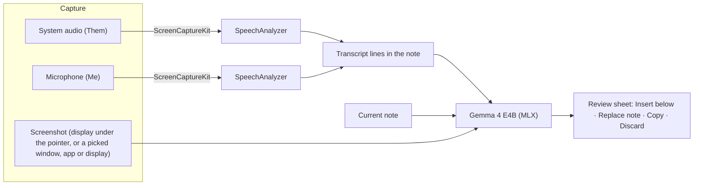

# On-Device AI & Meetings

brain-md runs Google's **Gemma 4 E4B** on your Mac with [MLX](https://github.com/ml-explore/mlx-swift) for summaries, action items, rewriting, screen explanations and free-form chat, and uses Apple's on-device **SpeechAnalyzer** to transcribe meetings. Notes, audio and screenshots never leave the Mac; the only network traffic is the one-time model download from Hugging Face (and Apple's speech model download per language).



## Features

| Feature | Where | What happens |
|---|---|---|
| Summarize Note | ✨ menu | Meeting-style minutes: summary, decisions, action items, open questions |
| Extract Action Items | ✨ menu | A Markdown checklist with owners and dates when the note mentions them |
| Polish & Rewrite | ✨ menu | Fixes grammar and structure, keeping facts, links, code and front matter |
| Explain Screen | ✨ menu › Explain Screen | **Screen Under Pointer** captures that display (without brain-md's windows). **Choose Window, App or Display…** opens the macOS picker so you can pick exactly what to explain. Gemma then explains the slide or diagram |
| Record a meeting | 🎙 toolbar button | Live transcript lines labelled **Them** / **Me** with timestamps; minutes from Gemma when you stop |
| Gemma Chat | ✨ menu › Chat with Gemma…, or View › Gemma Chat (⇧⌘J) | A conversation in its own window, optionally about the open note |

Gemma's output always opens in a **review sheet** first. Nothing is written to a note until you choose Insert Below or Replace Note (which asks for confirmation). Meeting transcript lines are the exception: they are written to the open note as they're finalized, and switching notes stops the recording.

Answers are in the note's language (in chat: the language you write in). Notes longer than about 8,000 tokens (32,000 characters) are truncated with a visible marker.

## Gemma Chat

A separate window for asking Gemma anything, without the preset actions.

- **Include current note** (on by default) sends the open note with your message. It's sent once and again only after you edit it, so follow-up questions stay fast.
- Each answer has **Copy** and **Insert into Note**, which appends it to the note that's open at that moment.
- **Stop** (⌘.) ends an answer early; **New Chat** clears the conversation.
- The conversation lives in memory only: it isn't saved and is gone when you quit. When the model unloads after five idle minutes, the next message reloads it and replays the last 20 exchanges so Gemma still remembers the conversation.

## Languages

Meetings are transcribed with Apple's **SpeechTranscriber**, the long-form model built for meetings, when it supports the language (English, French, German, Spanish and others). Languages it doesn't cover fall back to **DictationTranscriber**, which supports more, including **Dutch** (`nl_BE` and `nl_NL`). The Transcription Language picker lists every language either engine supports. A requested region the engines don't have maps to the language's main region (English in Belgium → `en_US`).

## Setup

**Settings › Local AI & Voice**

- **Enable on-device AI** downloads the model (6.8 GB) with live progress. Turning it off unloads the model and asks whether to delete the files.
- **Capture Incoming System Audio** / **Capture Microphone Audio** choose the meeting sources.
- **Transcription Language** defaults to the system language. Each language's speech model downloads once, the first time it's used.
- **Visual Diagram Comprehension** shows or hides Explain Screen.

### Permissions

| Permission | Needed for | Asked |
|---|---|---|
| Screen & System Audio Recording | Explain Screen › Screen Under Pointer, system audio in meetings | On first use, by macOS |
| Microphone | Your side of a meeting | When recording starts |

Choosing content with the picker needs no Screen Recording permission: picking is the consent. If the permission is already granted, a picked display also leaves out brain-md's own windows.

Speech recognition permission is not requested: SpeechAnalyzer transcribes on-device without it. The usage string is declared as a safeguard.

## The model

- **Checkpoint:** [`mlx-community/gemma-4-E4B-it-qat-4bit`](https://huggingface.co/mlx-community/gemma-4-E4B-it-qat-4bit), the quantization-aware-trained 4-bit conversion, which keeps more quality than post-training 4-bit. Its feed-forward layers stay at 8-bit, hence 6.8 GB.
- **Not the "qat-mobile" checkpoint:** that export uses mixed 2/4-bit weights with activation scales that mlx-swift-lm can't load.
- **Pinned revision:** the download is pinned to commit `0f35c6f6`. swift-transformers still depends on yyjson 0.12.0 ([GHSA-f4vc-345x-4mvm](https://github.com/advisories/GHSA-f4vc-345x-4mvm)), which parses the model's JSON files, so only this known set of files is ever parsed. Unpin once [huggingface/swift-transformers#392](https://github.com/huggingface/swift-transformers/pull/392) ships (`TODO` in `LocalModelManager`).
- **Storage:** `~/Library/Application Support/brain-md/models`, in the Hugging Face cache layout.
- **Memory:** loading checks that about 1.2× the model size is free (roughly 8 GB) and fails with a clear message otherwise. The model loads on first use and unloads after five idle minutes.
- **Audio:** Gemma 4's audio encoder isn't available in Swift (mlx-swift-lm drops `audio_tower` weights), so speech-to-text uses SpeechAnalyzer and Gemma works from the transcript.

## Code map

| File | Role |
|---|---|
| `Services/AI/LocalModelManager.swift` | Download, verify, load and unload the model |
| `Services/AI/HubAdapters.swift` | Bridges swift-huggingface and swift-transformers to mlx-swift-lm (replaces the MLXHuggingFace macros) |
| `Services/AI/GemmaService.swift` | Prompts and streaming generation, idle unload |
| `Services/AI/GemmaChat.swift` | Chat state, note context, session rebuild from history |
| `Services/AI/VisualCaptureService.swift` | Full-resolution screenshot of the display under the pointer, or of a window, app or display chosen in the system picker |
| `Services/AI/AudioCaptureService.swift` | ScreenCaptureKit system audio + microphone, levels |
| `Services/AI/MeetingTranscriber.swift` | Engine and locale choice, one SpeechAnalyzer per source, format conversion, language assets |
| `Services/AI/MeetingRecorder.swift` | Recording session: capture → transcript lines → minutes |
| `Views/AIResultSheet.swift` | Review sheet |
| `Views/GemmaChatView.swift` | Gemma Chat window |
| `Views/MeetingLiveOverlay.swift` | Live levels and partial transcript while recording |

## Testing

Unit tests cover prompts, model-file verification, audio conversion and levels, transcript formatting and coordinate conversion. Tests that need the real model or speech engine are opt-in:

```bash
TEST_RUNNER_BRAINMD_MODEL_INTEGRATION=1 xcodebuild test -project brain-md.xcodeproj -scheme brain-md -destination 'platform=macOS' -only-testing:brain-mdTests
```

```bash
TEST_RUNNER_BRAINMD_SPEECH_INTEGRATION=1 xcodebuild test -project brain-md.xcodeproj -scheme brain-md -destination 'platform=macOS' -only-testing:brain-mdTests
```

The model tests need the model downloaded (enable on-device AI in the app first); one checks that chat remembers the conversation after the model reloads. The speech tests synthesize sentences with `say` (Samantha in English; Ellen and Xander in Dutch, which need those voices installed) and check the transcripts, including a Dutch meeting with both sources at once. The first Dutch run downloads Apple's speech model.

Not automated, because they need macOS permission prompts or system UI: a real screen capture, the content picker and a real call recording.
