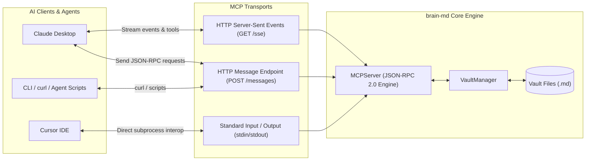
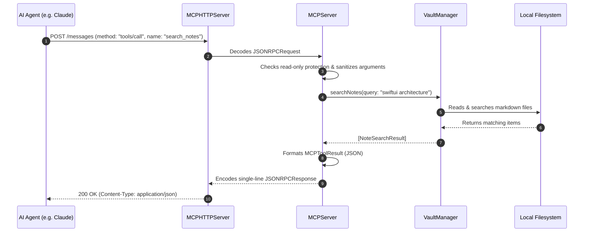

# Model Context Protocol (MCP) Server Guide

This document details the embedded **Model Context Protocol (MCP)** server within `brain-md`, its communication transports, and its complete tool API reference.

---

## What is MCP?

The [Model Context Protocol (MCP)](https://modelcontextprotocol.io) is an open standard developed by Anthropic that allows AI models (like Claude, Gemini, and GPT-4) to securely interact with local applications and data sources through standardized tools, resources, and prompts.

By running an embedded MCP server inside `brain-md`, external AI coding assistants and autonomous agents can:
- Directly query and read notes from your personal knowledge base.
- Conduct full-text searches across your notes.
- Automatically log meeting notes, code snippets, and research summaries.
- Reorganize files and directories in your vault.

---

## Server Architecture & Transports

`brain-md` supports dual transports for maximum client compatibility:



### 1. HTTP & Server-Sent Events (SSE)
- **Port**: Default is `8765` (configurable in **Settings > MCP Server**).
- **SSE Stream**: `GET http://127.0.0.1:8765/sse` maintains a persistent event stream.
- **Message Endpoint**: `POST http://127.0.0.1:8765/messages` accepts standard JSON-RPC 2.0 payloads.

### 2. Standard Input/Output (Stdio)
- For local process-based integration (e.g. command-line CLI invocations), `MCPStdioServer` processes line-delimited JSON-RPC requests on `stdin` and writes formatted single-line JSON responses on `stdout`.

---

## Agent Request Lifecycle



---

## Complete MCP Tool Reference

`brain-md` exposes 8 native tools:

### 1. `list_notes`
Lists all Markdown notes and directories in the vault.
- **Arguments**:
  - `path` *(string, optional)*: Relative directory path to list. Defaults to vault root.
- **Example Call**:
  ```json
  {
    "jsonrpc": "2.0",
    "id": 1,
    "method": "tools/call",
    "params": {
      "name": "list_notes",
      "arguments": { "path": "Research" }
    }
  }
  ```

---

### 2. `read_note`
Reads the raw Markdown content of a specific note.
- **Arguments**:
  - `path` *(string, required)*: Relative path to the `.md` file.
- **Example Call**:
  ```json
  {
    "jsonrpc": "2.0",
    "id": 2,
    "method": "tools/call",
    "params": {
      "name": "read_note",
      "arguments": { "path": "Project Ideas.md" }
    }
  }
  ```

---

### 3. `create_note`
Creates a new Markdown note in the vault. Automatically creates intermediate folders if needed.
- **Arguments**:
  - `path` *(string, required)*: Relative path for the new note (e.g. `Meetings/2026-09-18.md`).
  - `content` *(string, required)*: Markdown body content.
- **Example Call**:
  ```json
  {
    "jsonrpc": "2.0",
    "id": 3,
    "method": "tools/call",
    "params": {
      "name": "create_note",
      "arguments": {
        "path": "Research/AI Protocols.md",
        "content": "# AI Protocols\n\nNotes on MCP and agents.\n"
      }
    }
  }
  ```

---

### 4. `update_note`
Appends to or overwrites an existing note.
- **Arguments**:
  - `path` *(string, required)*: Relative path to the note.
  - `content` *(string, required)*: Markdown content to write or append.
  - `mode` *(string, optional)*: `"overwrite"` (default) or `"append"`.
- **Example Call**:
  ```json
  {
    "jsonrpc": "2.0",
    "id": 4,
    "method": "tools/call",
    "params": {
      "name": "update_note",
      "arguments": {
        "path": "Journal/Daily Log.md",
        "content": "\n- Completed code review at 15:00\n",
        "mode": "append"
      }
    }
  }
  ```

---

### 5. `delete_note`
Permanently deletes a note from the vault.
- **Arguments**:
  - `path` *(string, required)*: Relative path to the note to delete.
- **Example Call**:
  ```json
  {
    "jsonrpc": "2.0",
    "id": 5,
    "method": "tools/call",
    "params": {
      "name": "delete_note",
      "arguments": { "path": "Old Scratchpad.md" }
    }
  }
  ```

---

### 6. `search_notes`
Performs a fast, case-insensitive full-text and title search across all notes in the vault.
- **Arguments**:
  - `query` *(string, required)*: Search keyword or phrase.
- **Example Call**:
  ```json
  {
    "jsonrpc": "2.0",
    "id": 6,
    "method": "tools/call",
    "params": {
      "name": "search_notes",
      "arguments": { "query": "database schema" }
    }
  }
  ```

---

### 7. `get_vault_stats`
Returns summary statistics about the vault, including total note count, total word count, total storage size on disk, and recent activity logs.
- **Arguments**: None.
- **Example Call**:
  ```json
  {
    "jsonrpc": "2.0",
    "id": 7,
    "method": "tools/call",
    "params": {
      "name": "get_vault_stats",
      "arguments": {}
    }
  }
  ```

---

### 8. `move_note`
Renames a note or moves it to a new subdirectory within the vault.
- **Arguments**:
  - `sourcePath` *(string, required)*: Current relative path of the note.
  - `destinationPath` *(string, required)*: New relative path or directory.
- **Example Call**:
  ```json
  {
    "jsonrpc": "2.0",
    "id": 8,
    "method": "tools/call",
    "params": {
      "name": "move_note",
      "arguments": {
        "sourcePath": "Drafts/Spec.md",
        "destinationPath": "Archived/Spec.md"
      }
    }
  }
  ```

---

## Testing via cURL

You can test the MCP HTTP server directly from your macOS terminal:

```bash
# 1. Initialize MCP session
curl -X POST http://127.0.0.1:8765/messages \
  -H "Content-Type: application/json" \
  -d '{"jsonrpc":"2.0","id":1,"method":"initialize","params":{"protocolVersion":"2024-11-05","capabilities":{},"clientInfo":{"name":"test-client","version":"1.0"}}}'

# 2. List available tools
curl -X POST http://127.0.0.1:8765/messages \
  -H "Content-Type: application/json" \
  -d '{"jsonrpc":"2.0","id":2,"method":"tools/list","params":{}}'

# 3. Call search_notes
curl -X POST http://127.0.0.1:8765/messages \
  -H "Content-Type: application/json" \
  -d '{"jsonrpc":"2.0","id":3,"method":"tools/call","params":{"name":"search_notes","arguments":{"query":"welcome"}}}'
```
