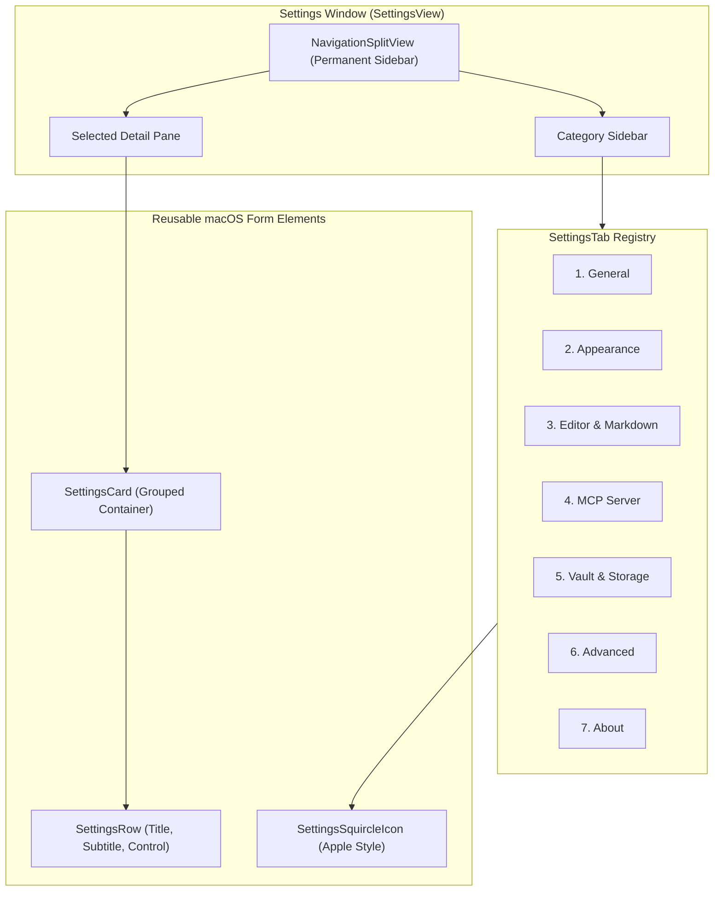

# Settings & Customization Guide

This document details the configuration options, template customization, and window architecture of the `brain-md` Settings interface.

---

## macOS System Settings Architecture

Inspired by macOS Ventura, Sonoma, and Sequoia System Settings, `brain-md` provides a centralized settings window accessible via `⌘,` or **brain-md > Settings...** in the menu bar.

---

## The 7 Configuration Panes

### 1. General Settings
- **New Note Title Format**:
  - Presets: `Untitled`, `Date (YYYY-MM-DD)`, `Daily Journal`.
  - **Custom…**: Revealing a text field with a live evaluated preview badge (`Preview: Note - 2026-09-18.md`) and clickable token pills (`{date}`, `{time}`, `{year}`, `{month}`, `{day}`).
- **Default Note Content Template**:
  - Presets: `Heading Only`, `Date & Heading`, `Daily Journal`, `Meeting Notes`, `Blank`.
  - **Custom…**: Revealing an embedded monospace `TextEditor` input window supporting dynamic token replacement (`{{title}}`, `{{date}}`, `{{time}}`) and a "Reset to Default Template" button.
- **Start MCP Server at Launch**: Toggle to automatically boot the local HTTP/SSE server on application startup.
- **Auto-Save Delay**: Configurable debounce intervals (`0.5s` Instant, `1.0s` Normal, `3.0s` Relaxed).
- **Background File Watcher**: Real-time detection of external edits made by Obsidian, Git, or VS Code.

---

### 2. Appearance
- **App Color Scheme**: Force `System`, `Dark`, or `Light` appearance mode.
- **Accent Color**: System default or customized highlight palette.
- **Mermaid Theme Mode**:
  - `Adaptive`: Automatically toggles between GitHub Dark and Light based on macOS system appearance.
  - `GitHub Dark`: Always forces high-contrast dark diagram styling.
  - `GitHub Light`: Always forces crisp light diagram styling.

---

### 3. Editor & Markdown
- **Default View Mode**: Choose default layout when launching (`Split`, `Editor Only`, or `Preview Only`).
- **Font Size**: Continuous slider from `11pt` to `24pt` with live editor preview.
- **Font Family**: Select between `System`, `Monospaced`, `Rounded`, or `Serif`.
- **Word Counter**: Toggle the live floating status badge in the bottom toolbar.
- **Syntax Highlighting Theme**: Switch highlighting contrast levels for code fences and Markdown tokens.

---

### 4. MCP Server
- **Server Status Indicator**: Real-time status display showing active port with live green pulsating beacon.
- **Restart Server Button**: Instantly reboot the HTTP/SSE listener if port conflicts arise.
- **Preferred Port Field**: Customize local listening port (default: `8765`).
- **Read-Only Mode Guard**: Toggle preventing external AI agents from modifying or deleting notes.
- **1-Click Claude Desktop Configuration**: Copies the required JSON snippet for immediate paste into `claude_desktop_config.json`.

---

### 5. Vault & Storage
- **Active Vault Path**: Displays the full POSIX filesystem location of your active notes folder.
- **Change Location...**: Native macOS open panel dialog to switch or create a different vault directory.
- **Reveal in Finder**: Opens the vault root in Finder with one click.
- **Vault Statistics**: Total note count, active file monitor status.
- **Re-seed Starter Notes**: Recreates default tutorial notes (`Welcome to Brain-md.md`, `Project Ideas.md`) if accidentally deleted.

---

### 6. Advanced
- **Clear Memory Caches**: Flushes in-memory AST and syntax highlighting token caches.
- **Diagnostic Log Level**: Configure activity logger verbosity (`Verbose`, `Info`, `Errors Only`).
- **Reset All Preferences**: Restores factory defaults across all `@AppStorage` keys.

---

### 7. About
- **App Identity**: High-resolution `brain.head.profile` icon with blue-to-purple gradient.
- **Version & Build**: Version 1.0 (Build 1).
- **Technology Stack**: Native Swift 6, AppKit, SwiftUI, MCP 1.0 Protocol.
- **Repository Link**: Direct link to the open-source GitHub repository.

---

## Window Styling & Native Margins

The settings window is engineered to match macOS System Settings standards via `SettingsWindowConfigurator`:
- **Unified Toolbar**: Uses `.windowToolbarStyle(.unified(showsTitle: true))` to ensure generous titlebar height.
- **Traffic Light Margins**: Traffic light buttons (close, minimize, zoom) are aligned with standard native margins (at least 20pt from window edges).
- **Permanent Non-Collapsible Sidebar**: The underlying `NSSplitView` items have `canCollapse = false` and `columnVisibility = .constant(.all)`, ensuring the sidebar cannot be accidentally hidden.
