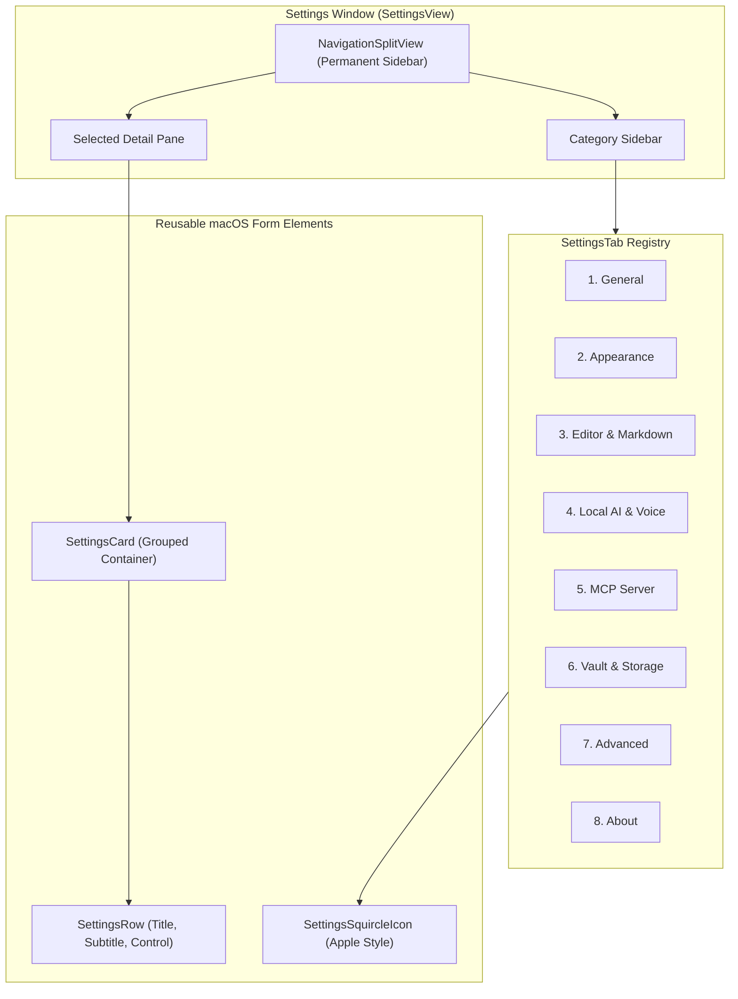

# Settings & Customization Guide

This document details the configuration options, template customization, and window architecture of the `brain-md` Settings interface.

---

## macOS System Settings Architecture

Inspired by macOS Ventura, Sonoma, and Sequoia System Settings, `brain-md` provides a centralized settings window accessible via `⌘,` or **brain-md > Settings...** in the menu bar.

```mermaid
graph TD
    subgraph Scene ["Settings Window (SettingsView)"]
        Nav["NavigationSplitView (Permanent Sidebar)"]
        Sidebar["Category Sidebar"]
        Panes["Selected Detail Pane"]
    end

    subgraph Tabs ["SettingsTab Registry"]
        T1["1. General"]
        T2["2. Appearance"]
        T3["3. Editor & Markdown"]
        T4["4. Local AI & Voice"]
        T5["5. MCP Server"]
        T6["6. Vault & Storage"]
        T7["7. Advanced"]
        T8["8. About"]
    end

    subgraph Components ["Reusable macOS Form Elements"]
        Card["SettingsCard (Grouped Container)"]
        Row["SettingsRow (Title, Subtitle, Control)"]
        Icon["SettingsSquircleIcon (Apple Style)"]
    end

    Nav --> Sidebar
    Nav --> Panes
    Sidebar --> Tabs
    Panes --> Card
    Card --> Row
    Tabs --> Icon
```

---

## The 8 Configuration Panes

### 1. General Settings

- **New Note Title Format**:
  - Presets: `Untitled`, `Date (YYYY-MM-DD)`, `Daily Journal`.
  - **Custom…**: Revealing a text field with a live evaluated preview badge (`Preview: Note - 2026-09-18.md`) and clickable token pills (`{date}`, `{time}`, `{year}`, `{month}`, `{day}`).
- **Default Note Content Template**:
  - Presets: `Heading Only`, `Date & Heading`, `Daily Journal`, `Meeting Notes`, `Blank`.
  - **Custom…**: Revealing an embedded monospace `TextEditor` input window supporting dynamic token replacement (`{{title}}`, `{{date}}`, `{{time}}`) and a "Reset to Default Template" button.
- **Start MCP Server at Launch**: Toggle to automatically boot the local HTTP/SSE server on application startup.
- **Auto-Save Delay**: Configurable debounce intervals (`0.5s` Instant, `1.0s` Normal, `3.0s` Relaxed).
- **Background File Watcher**: Real-time detection of external edits made by Obsidian, Git, or VS Code.

---

### 2. Appearance

- **App Color Scheme**: Force `System`, `Dark`, or `Light` appearance mode.
- **Accent Color**: System default or customized highlight palette.
- **macOS App Icon Theme Tracking**:
  - Engineered with Apple Icon Composer (`brain-md.icon`), compiling native `NSAppearanceNameAqua` and `NSAppearanceNameDarkAqua` icon stacks.
  - Automatically switches the macOS Dock and App Switcher icon to match system Light and Dark mode without manual intervention or static overrides.
- **Mermaid Theme Mode**:
  - `Adaptive`: Automatically toggles between GitHub Dark and Light based on macOS system appearance.
  - `GitHub Dark`: Always forces high-contrast dark diagram styling.
  - `GitHub Light`: Always forces crisp light diagram styling.
- **Live Theme Preview Card**:
  - Displays the active theme name, theme family, dark/light classification, and background hex pill.
  - Horizontal ANSI 16-color palette bar with indexed swatches.
  - Real-time syntax highlighting code preview formatted in an Apple HIG rounded card with generous 14pt margins matching standard settings rows.

---

### 3. Editor & Markdown

- **Default View Mode**: Choose default layout when launching (`Split`, `Editor Only`, or `Preview Only`).
- **Workspace Layout & Split Proportion**: Configure the editor-to-preview split ratio slider (`20%` to `80%`, stored in `@AppStorage("editor_split_ratio")`), with a 1-click **Reset to 50/50** button. Also adjustable by dragging the center split divider directly in the editor.
- **Font Size**: Continuous slider from `11pt` to `24pt` with live editor preview.
- **Font Family**: Select between `System`, `Monospaced`, `Rounded`, or `Serif`.
- **Word Counter**: Toggle the live floating status badge in the bottom toolbar.
- **Syntax Highlighting Theme**: Switch highlighting contrast levels for code fences and Markdown tokens.

---

### 4. Local AI & Voice

- **Enable on-device AI**: Downloads Gemma 4 E4B (`mlx-community/gemma-4-E4B-it-qat-4bit`, 6.8 GB) to Application Support with live byte progress and cancel. Turning it off unloads the model and offers to delete the files, showing their size. Failed downloads show the error and a Retry that keeps partial files.
- **Capture Incoming System Audio**: Records other meeting participants ("Them") through `ScreenCaptureKit`.
- **Capture Microphone Audio**: Records your side ("Me") through `ScreenCaptureKit`'s microphone capture.
- **Custom Instructions**: Your own instructions for Gemma (up to 2,000 characters), added to every request in chat and the ✨ menu.
- **Skills**: Your saved prompts, stored as Markdown files in the vault's `Skills` folder. Edit, create, show in Finder, or restore the defaults. See [Instructions & Skills](local-ai.md#instructions--skills).
- **Transcription Language**: The language meetings are transcribed in, including Dutch (Belgium and Netherlands); defaults to the system language. Each language's speech model downloads once.
- **Visual Diagram Comprehension**: Shows the **Explain Screen** submenu in the ✨ menu: **Screen Under Pointer** or **Choose Window, App or Display…**.

See [On-Device AI & Meetings](local-ai.md) for permissions, privacy and model details.

---

### 5. MCP Server

- **Server Status Indicator**: Real-time status display showing active port with live green pulsating beacon.
- **Restart Server Button**: Instantly reboot the HTTP/SSE listener if port conflicts arise.
- **Preferred Port Field**: Customize local listening port (default: `8765`).
- **Read-Only Mode Guard**: Toggle preventing external AI agents from modifying or deleting notes.
- **1-Click Claude Desktop Configuration**: Copies the required JSON snippet for immediate paste into `claude_desktop_config.json`.

---

### 6. Vault & Storage

- **Active Vault Path**: Displays the full POSIX filesystem location of your active notes folder.
- **Change Location...**: Native macOS open panel dialog to switch or create a different vault directory.
- **Reveal in Finder**: Opens the vault root in Finder with one click.
- **Vault Statistics**: Total note count, active file monitor status.
- **Re-seed Starter Notes**: Recreates default tutorial notes (`Welcome to Brain-md.md`, `Project Ideas.md`) if accidentally deleted.

---

### 7. Advanced

- **Clear Memory Caches**: Flushes in-memory AST and syntax highlighting token caches.
- **Diagnostic Log Level**: Configure activity logger verbosity (`Verbose`, `Info`, `Errors Only`).
- **Reset All Preferences**: Restores factory defaults across all `@AppStorage` keys.

---

### 8. About

- **App Identity**: High-resolution `brain.head.profile` icon with blue-to-purple gradient.
- **Version & Build**: Read from the app bundle (for example "Version 1.1 (Build 412)"); the build number is the commit count at release.
- **Technology Stack**: Native Swift 6, AppKit, SwiftUI, MCP 1.0 Protocol.
- **Repository Link**: Direct link to the open-source GitHub repository.

---

## Window Styling & Native Margins

The settings window is engineered to match macOS System Settings standards via `SettingsWindowConfigurator`:

- **Unified Toolbar**: Uses `.windowToolbarStyle(.unified(showsTitle: true))` to ensure generous titlebar height.
- **Traffic Light Margins**: Traffic light buttons (close, minimize, zoom) are aligned with standard native margins (at least 20pt from window edges).
- **Permanent Non-Collapsible Sidebar**: The underlying `NSSplitView` items have `canCollapse = false` and `columnVisibility = .constant(.all)`, ensuring the sidebar cannot be accidentally hidden.
