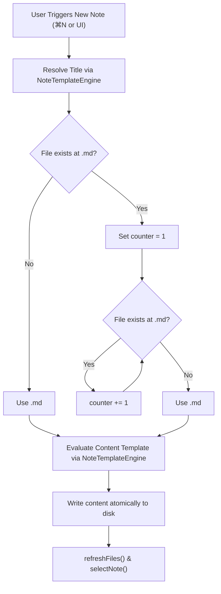
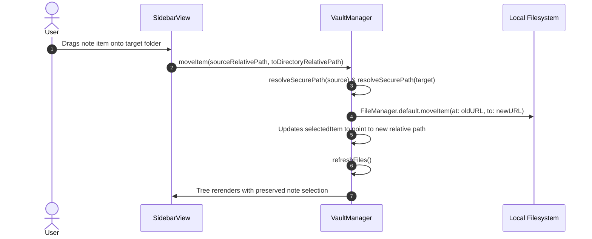

# Vault & File Management

This document details how `brain-md` stores, organizes, monitors, and operates on Markdown notes on your Mac's filesystem.

---

## The Vault Model

A **vault** in `brain-md` is a local directory containing `.md` files and nested subdirectories. Unlike database-backed note apps, `brain-md` stores every note directly as standard UTF-8 text on disk.

```
📁 ~/Documents/Brain-md/ (Vault Root)
├── 📄 Welcome to Brain-md.md
├── 📄 Project Ideas.md
├── 📁 Research/
│   ├── 📄 Architecture Notes.md
│   └── 📄 Benchmarks.md
└── 📁 Journal/
    ├── 📄 2026-09-17.md
    └── 📄 2026-09-18.md
```

### Key Advantages
- **No Vendor Lock-In**: Notes are readable by any text editor (Obsidian, VS Code, Sublime Text, Vim).
- **Version Control Ready**: Easily turn your vault into a Git repository (`git init`) to track revision history across machines.
- **Instant Search**: Notes are indexed natively by macOS Spotlight.

---

## Data Model: `NoteItem`

The directory hierarchy is represented in-memory as a tree of `NoteItem` structs:

```swift
public struct NoteItem: Identifiable, Hashable, Sendable {
    public let id: String                    // Unique path identifier
    public let name: String                  // Filename or directory name
    public let relativePath: String          // Path relative to vault root
    public let isDirectory: Bool             // true for folders, false for .md files
    public var children: [NoteItem]?         // Recursive sub-items if directory
    public let modificationDate: Date?       // Last modified timestamp
    public let sizeBytes: Int64              // File size in bytes
}
```

### Tree Construction
Directory traversal uses depth-first recursion via `scanDirectory(url:base:noteCount:)`, automatically sorting directories first, followed by Markdown notes alphabetically. Files without `.md` extensions and hidden files (starting with `.`) are ignored.

---

## Note Creation & Collision Resolution

When creating notes, `brain-md` uses `generateUniqueNotePath` to prevent overwriting existing files:



---

## Note Drag-and-Drop & Organization

`brain-md` supports native drag-and-drop note reordering and reorganization within the sidebar.



### Selection Preservation
When a note or folder is moved or renamed, `VaultManager` preserves the active selection by updating `selectedItem` to the new relative path so the user never loses their active editor context.

---

## Template Engine: `NoteTemplateEngine`

`brain-md` features a dual template engine:
1. **Title Format Engine**: Dictates the naming convention for new files.
2. **Content Template Engine**: Dictates the initial Markdown body.

### Dynamic Tokens Reference

| Token | Single Brace | Double Brace | Format / Output | Example |
| :--- | :--- | :--- | :--- | :--- |
| **Note Title** | `{title}` | `{{title}}` | Current note title | `Architecture Review` |
| **Date** | `{date}` | `{{date}}` | `yyyy-MM-dd` | `2026-09-18` |
| **Time** | `{time}` | `{{time}}` | `HH-mm` (Title) / `HH:mm` (Body) | `14-30` / `14:30` |
| **Year** | `{year}` | `{{year}}` | `yyyy` | `2026` |
| **Month** | `{month}` | `{{month}}` | `MM` | `09` |
| **Day** | `{day}` | `{{day}}` | `dd` | `18` |

---

## Live Background File Synchronization

To maintain full interoperability with external tools like Obsidian, Git, or VS Code, `VaultManager` embeds `VaultFileMonitor`:

- **Mechanism**: Utilizes `DispatchSourceFileSystemObject` bound to the vault's directory file descriptor.
- **Event Handling**: Listens for `.write`, `.delete`, `.rename`, and `.extend` events.
- **Debounced Rescanning**: When rapid external changes occur (e.g. `git checkout` or automated scripts), events are coalesced to prevent UI churn.
- **In-Memory Conflict Protection**: If an external change modifies the note currently loaded in the editor, `brain-md` intelligently syncs the content without discarding uncommitted keystrokes.
